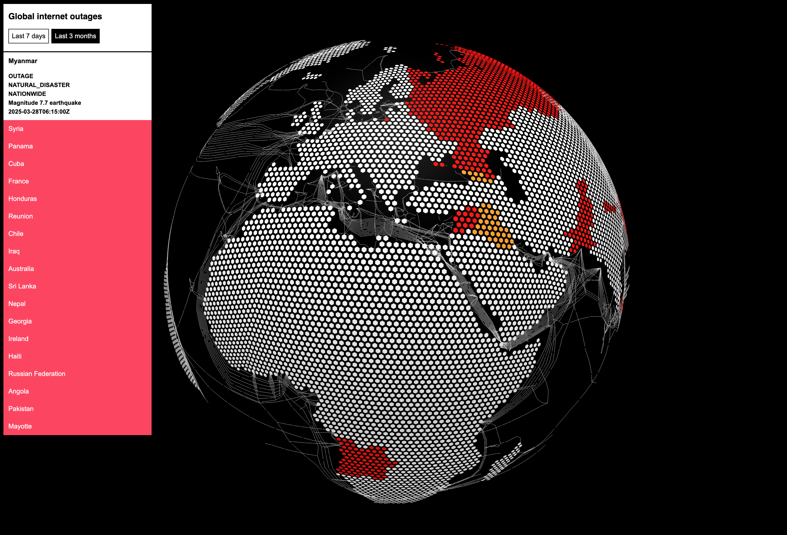

# Internet outage globe map

Still under development.

Development of the [lightweight internet outages tracker](https://internetoutages.netlify.app/) using the globe.gl library. Outages data are sourced from [Cloudflare Radar](https://radar.cloudflare.com/).

If you wish to run this project locally, you can do so by running `npm install` and then `npm run dev`.

